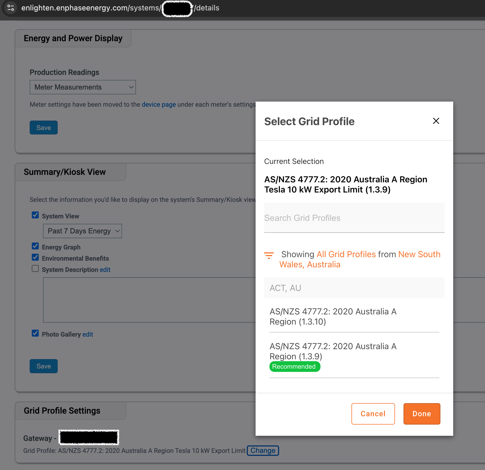

# Amber × Enphase Zero-Export Switcher (TypeScript + AWS)


Inspired by the excellent work of [Amber Enphase Zero Export Switcher Tool](https://github.com/ZimbiX/amber-enphase-zero-export-switcher-tool?tab=readme-ov-file).

This implementation is written in TypeScript and deployed to AWS as a single-file Lambda, scheduled to run via EventBridge Scheduler. It automatically toggles your battery-less [Enphase](https://enphase.com/) grid profile to prevent exporting when [Amber Electric](https://www.amber.com.au/) feed-in prices are negative.

Avoid getting charged for exporting during negative price events.

## Motivation

After multiple attempts, I couldn’t get the [Amber Enphase Zero Export Switcher Tool](https://github.com/ZimbiX/amber-enphase-zero-export-switcher-tool?tab=readme-ov-file) to work. Both Enphase support and my solar installer confirmed that adding another grid profile is not possible.

Having requested DIY installer access via the [Enphase Service Manager](https://enlighten.enphaseenergy.com/), I discovered that the Grid Profile can be changed through the Service Manager interface. The main challenge was implementing programmatic authentication. Once authenticated, it was straightforward to inspect the API requests and replicate them programmatically.



## How it works

- Fetch current import/export prices from Amber.
- Decide whether exporting “costs” you (negative FiT).
- Set Enphase grid profile to zero-export when it’s costly; otherwise restore normal export.
- Runs every 10 minutes between 10:00–16:59 Australia/Sydney time.

## Architecture

- Lambda (Node 20, CJS handler `index.handler`) bundled via esbuild to `dist/index.js`.
- EventBridge Scheduler with timezone set to Australia/Sydney.
- Pulumi TypeScript stack under `infra/` provisions IAM, Lambda, and schedule.

## Prerequisites

- Node 20+, npm
- Pulumi CLI installed and logged in
- AWS credentials configured for your target account/region

## Setup

1. Install dependencies

```bash
npm i
cd infra && npm i && cd ..
```

2. Configure environment
   Create `.env` from the example and fill values:

```ini
AMBER_TOKEN=
AMBER_SITE_ID=
ENPHASE_EMAIL=
ENPHASE_PASSWORD=
ENPHASE_SYSTEM_ID=
ENPHASE_SERIAL_NUMBER=
ENPHASE_PART_NUMBER=
ENPHASE_GRID_PROFILE_NAME_ZERO_EXPORT_ID=
ENPHASE_GRID_PROFILE_NAME_NORMAL_EXPORT_ID=
```

3. Build Lambda bundle

```bash
npm run build   # outputs dist/index.js with exported handler
```

4. Configure Pulumi

```bash
cd infra
pulumi stack init prod            # or: pulumi stack select prod
pulumi config set aws:region ap-southeast-2

# Map .env values into Pulumi config (UPPERCASE keys)
sh scripts/set-pulumi-config-from-env.sh

# verify config
pulumi config
```

5. Deploy

```bash
pulumi up
```

Outputs:

```bash
pulumi stack output functionName
pulumi stack output scheduleArn
```

## Local run

```bash
npm run start
```

## Updating

```bash
npm run build
cd infra && pulumi up
```

## Teardown

```bash
cd infra
pulumi destroy
```

## Notes / Troubleshooting

- If your shell complains about stack names (zsh globbing), quote them: `pulumi up --stack 'prod'`.
- If IAM permission errors occur, ensure the Scheduler role has `lambda:InvokeFunction` on the function (managed by Pulumi in `infra/index.ts`).
- The schedule uses EventBridge Scheduler with `scheduleExpressionTimezone: "Australia/Sydney"` and `cron(0/10 10-16 ? * * *)`.
- Lint/format:

```bash
npm run lint
npm run format
```
